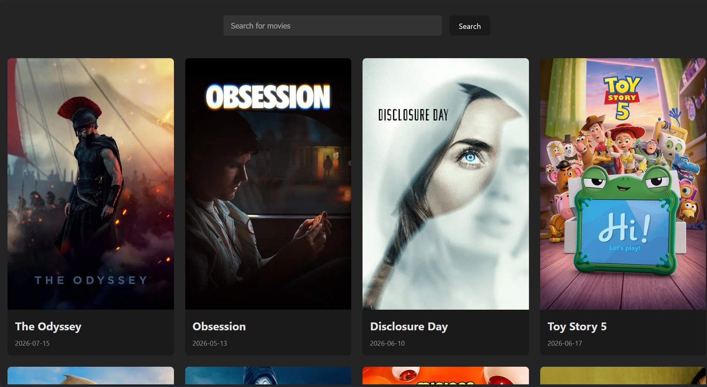

# Movie Web

A React + Vite movie browsing app that uses The Movie Database (TMDB) API to show popular movies and search for titles. The app displays movie posters, release dates, and a responsive movie grid built with custom styling.

## Preview



## Features

- Load and display popular movies from TMDB on first visit.
- Search for movies by title.
- Show movie posters, titles, and release dates.
- Responsive grid layout for browsing on different screen sizes.
- Loading and error states for API requests.

## Tech Stack

- React 19
- Vite
- TMDB API
- Plain CSS

## TMDB API Setup

This project requires a TMDB API key.

1. Create an account at [themoviedb.org](https://www.themoviedb.org).
2. Generate your API key from your TMDB account settings.
3. Open [src/services/api.js](src/services/api.js) and replace the placeholder value in `API_KEY` with your own key.

## Installation

```bash
npm install
```

## Development

```bash
npm run dev
```

## Build

```bash
npm run build
```

## Preview Production Build

```bash
npm run preview
```

## Project Structure

```text
src/
	Pages/
		Home.jsx
		MovieCard.jsx
		NavBar.jsx
	services/
		api.js
	css/
		App.css
		Home.css
		index.css
		MovieCard.css
		Navbar.css
	assets/
		preview.png
```

## How It Works

- `Home.jsx` fetches popular movies on load and handles search submissions.
- `api.js` contains the TMDB requests for popular movies and search results.
- `MovieCard.jsx` renders each movie card using TMDB poster images.
- CSS files handle the layout and responsive styling.

## Notes

- If a movie does not have a poster image, you may want to add a fallback image in the UI.
